<!-- README.md is generated from README.Rmd. Please edit that file -->

# BFluxR

<!-- badges: start -->
<!-- badges: end -->

**Goals and Introduction**

BFluxR is a R interface to BFlux.jl which itself extends the famous
Flux.jl machine learning library in Julia. BFlux is meant to make
research and testing of Bayesian Neural Networks easy. It is not meant
for production, but rather for explorations. Currently only regression
problems are being kept in mind during the development, since those are
the problems I am workin on. Extending things to classification problems
should be rather straight forward though, since BFlux allows custom
implementation of likelihoods and priors (at least in the Julia
version). In the R version presented here, this is currently not
possible.

## Basics

BFluxR’s and BFlux’s are based on Flux.jl and thus take over a lot of
their syntaxt. Before we demonstrate this, we first need to install and
load BFluxR. Installation is currently only possible from Github:

``` r
# devtools::install_github("enweg/BFluxR")
```

BFluxR depends on BFlux.jl which is a library written in Julia. Hence,
to run BFluxR, we need a way to access Julia. This is provided by the
JuliaCall library. So we also need to install that library. I recommend
installing the github version.

``` r
# devtools::install_github("Non-Contradiction/JuliaCall")
```

We are now ready to start exploring BFluxR. We first need to load the
package and run the setup. This will install Julia if you do not yet
have it and will install all the Julia dependencies, including BFlux.jl.
If you already do have Julia installed, then the script will pick the
Julia verion on your computer. If you, like me, have multiple version
installed, can define the version you want to use by setting the
`JULIA_HOME` variable to the path of the Julia version you want to use.
So, most users can ignore tha `JULIA_HOME` variable set below. Running
these lines for the first time can take a while, since it will possibly
have to install Julia and all dependencies. After this, if you do no
longer wish you check if all dependencies are available, you can set
`pkg_check = FALSE`.

``` r
library(BFluxR)
#> 
#> Attaching package: 'BFluxR'
#> The following object is masked from 'package:stats':
#> 
#>     Gamma
BFluxR_setup(JULIA_HOME = "/Applications/Julia-1.7-Rosetta.app/Contents/Resources/julia/bin/", seed = 6150533)
#> Julia version 1.7.2 at location /Applications/Julia-1.7-Rosetta.app/Contents/Resources/julia/bin will be used.
#> Loading setup script for JuliaCall...
#> Finish loading setup script for JuliaCall.
#> Set the seed of Julia and R to 6150533
```

After loading BFluxR and running the setup, we are now ready to
experiment around. To create a Bayesian Neural Network, we first need a
Neural Network. In the Flux.jl context and thus also here, a network is
defined as a chain of layers. This is intuitively represented in the
syntax below, which creates a feedforward neural network with one hidden
layer with `tanh` activation function. The last `Dense(1, 1)` statement
are the output connection. The chain below thus says: Feed a vector

into the network. Tranform this input via
").
The output is then given by
.

``` r
net <- Chain(Dense(1, 1, "tanh"), Dense(1, 1))
```

For every layer, BFlux automatically introduces priors. Currently, for
all weights and biases, these are Normal priors with mean zero and
variance

for

indexing all network parameters. All

then follow a
")
hyper-prior. Changes to this can be made in BFlux.jl, but not currently
in BFluxR. To transform the network into a Bayesian model, we also need
a likelihood. For the feedforward context we are currently working in,
BFluxR currently implements two likelihoods. A normal and a scaled and
shifted t-distribution. We will for now focus on the normal case.

``` r
loglike <- likelihood.feedforward_normal(Gamma(2.0, 2.0))
```

Note, careful readers might have notices that so far we only implemented
priors for all network parameters and a hyper-prior on their variances.
We did not yet implement any prior on the models error variance though.
This is only done at the point at which we define a likelihood. Here I
chose for a `Gamma` prior, but BFlux also allows for `InverseGamma` as
well as a truncated normal prior via `Truncated(Normal(0, 1), 0, Inf)`.

Now that we have priors on all parameters as well as a likelihood, all
that is left is to have some data. Here we will take an AR(1) for the
simple reason that time series applications were the first application
for which BFlurR and BFlux were implemented.

``` r
n <- 600
y <- arima.sim(list(ar = 0.5), n = 600)
y.train <- y[1:floor(5/6*n)]
y.test <- y[(floor(5/6*n)+1):n]
x.test <- matrix(y.test[1:(length(y.test)-1)], nrow = 1) # In BFlux, rows are variables, columns are observations
x.train <- matrix(y.train[1:(length(y.train)-1)], nrow = 1)
y.test <- y.test[2:length(y.test)]
y.train <- y.train[2:length(y.train)]

plot.ts(y, xlab = "", ylab = "", main = "Simulated AR(1) Data")
abline(v = 500, lty = 2, lw = 2, col = "red")
text(x = 500, y = 2.5, labels = "End Training Data", col = "red")
```

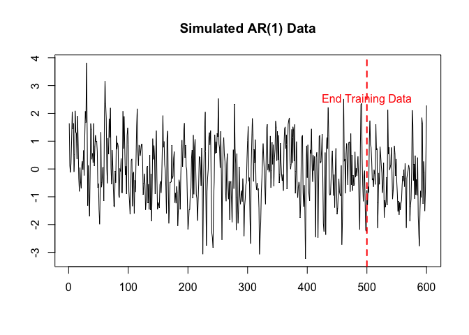

We now have everything to create a Bayesian Model. This is simply done
by calling `BNN` with the network specification, the likelihood, and the
data.

``` r
bnn <- BNN(net, loglike, y.train, x.train)
```

## Mode and Modal Approximations

The simplest way in which we can estimate our model is by finding the
posterior mode and taking this as the single best estimate. We have two
options to do so. We can either use the full gradient or we can use the
more common stoachastic gradient. As long as the dataset is small, this
will not be much different, since SGD will often need more iterations
than full gradient descent. For larger data sets, I do recommend opting
for SGD though. The first time (in each session) any estimation function
is evaluated, it will take some time, since Julia will first compile the
code. This is similar to what Stan does, just that Stan does it
immediately, while Julia and hence BFluxR/BFlux is just-in-time
compiled.

``` r
mode.full <- find_mode(bnn, 1000, 1e-1) # Using full gradient with 10K max iterations
```

``` r
# Note here how we call BNN.totparams to obtain the total number of 
# parameters to be estimated in the model. This often comes in handy. 
# We also again choose a max of 10K epochs and a mini-batch of 99 samples. 
# This does not perfectly partition the data; hence the warning.
mode.sgd <- find_mode_sgd(bnn, 99, rnorm(BNN.totparams(bnn)), 10000, 1e-6)
```

Let us check the two mode estimates. We can first check whether both
have converged. This indeed seems to be the case here.

``` r
c(mode.full$has_converged, mode.sgd$has_converged)
#> [1] TRUE TRUE
```

For the SGD version, we can also look at the loss curve. This is
currently not implemented for the full gradient version.

``` r
plot.ts(mode.sgd$loss, xlab = "iteration", ylab = "log-posterior")
```

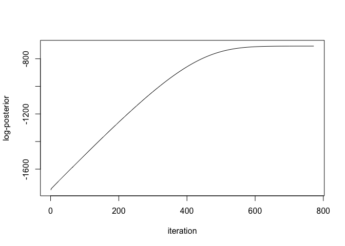

Lastly, we can compare the actual modes with each other. **Note: even
small NN often suffer from multi-modality**.

``` r
rbind(mode.full$mode, mode.sgd$mode)
#>              [,1]       [,2]         [,3]       [,4]        [,5]      [,6]
#> [1,] -0.018740062 -0.8552099 0.2295030387 -0.4474064 -0.93744791 0.4496503
#> [2,] -0.009085628  0.1983049 0.0003328517  0.5685289  0.01834023 0.4228325
#>            [,7]      [,8]        [,9]
#> [1,] 0.40418308 -1.426695  0.16956553
#> [2,] 0.00162236  1.112189 -0.04020622
```

In theory, we could now test whether these two modes behave differntly.
This is not the goal here though, since this could be done with any
other machine learning library. Instead, the above was only meant to
show that even a small model such as the one here can suffer from
multimodality and hence Bayesian estimation is notoriously tricky.

Before we come to more advanced methods of Bayesian estimation, we will
first focus on one of the most basic methods: Laplace approximations
around a mode. Or better here: around multiple modes. BFlux allows for
the estimation of modes in parallel and allows to form a (diagonal)
multivariate normal approximation around all these modes. Taking all
these approximation together then gives a mixture of normals (equally
weighted).

``` r
# We are going for 5 modes. 
lapprox <- laplace(bnn, 10000, 5, tol = 1e-6)
```

We can then directly draw samples from this mixture of normals. We also
here clearly see the multimodality.

``` r
ldraws <- BFluxR::draw.laplace(lapprox, n = 10000)
hist(ldraws[dim(ldraws)[1]-1, ], breaks = 50)
```

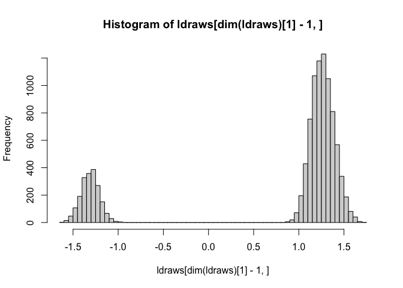

Lets see how we fare in predictive performance. We can obtain posterior
predictive draws using the test data by calling `posterior_predict`.

``` r
ppred <- posterior_predict(bnn, ldraws, newx = x.test)
dim(ppred)
#> [1]    99 10000
```

We can use these posterior predictive values to test the model in
various ways. Here we will only use them to form the posterior
predictive mean, which we will use as our best prediction, and to form
credible intervals.

``` r
p.mean <- apply(ppred, 1, mean)
p.upper <- apply(ppred, 1, function(x) quantile(x, 0.975))
p.lower <- apply(ppred, 1, function(x) quantile(x, 0.025))
```

Using these values we can check for predictive performance and coverage.
Let us first make a plot. We can see that the laplace approximations are
much too overconfident.

``` r
plot(1:length(y.test), y.test, "l", col = "black", xlab = "", ylab = "", ylim = c(min(y.test), max(y.test) + 1.0))
lines(1:length(y.test), p.mean, col = "red")
lines(1:length(y.test), p.upper, col = "red", lty = 2)
lines(1:length(y.test), p.lower, col = "red", lty = 2)
legend(-3.5, max(y.test) + 1.0, c("Truth", "PP Mean"), col = c("black", "red"), lty = c(1, 1))
```

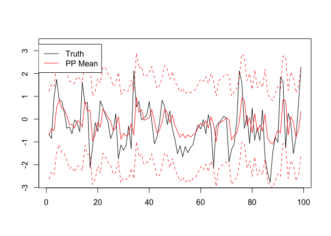

``` r
mean((y.test - p.mean)^2)
#> [1] 0.8972062
```

``` r
mean((y.test > p.upper) | (y.test < p.lower))
#> [1] 0.07070707
```

Before we go to more advanced methods, we have one more trick up our
sleeves that could possibly improve our laplace approximation. We could
take the draws from our approximation and use them as our proposal draws
in a Samples-Importance-Resampling scheme. **Although this often
performs bad in high-dimensions, we will often still find some
improvement**. We will see later though, that other methods that are
just as computationally expensive as these laplace approximations
(with/without) SIR usually perform better. Nevertheless, for
completeness, we will check if SIR can improve the above.

``` r
sirdraws <- SIR.laplace(bnn, lapprox, 100000, 10000) # We need many more initial draws than we want to have
ppred <- posterior_predict(bnn, sirdraws, newx = x.test)
p.mean <- apply(ppred, 1, mean)
p.upper <- apply(ppred, 1, function(x) quantile(x, 0.975))
p.lower <- apply(ppred, 1, function(x) quantile(x, 0.025))
```

Making the same graph as above then results in no improvement at all.

``` r
plot(1:length(y.test), y.test, "l", col = "black", xlab = "", ylab = "", ylim = c(min(y.test), max(y.test) + 1.0))
lines(1:length(y.test), p.mean, col = "red")
lines(1:length(y.test), p.upper, col = "red", lty = 2)
lines(1:length(y.test), p.lower, col = "red", lty = 2)
legend(-3.5, max(y.test) + 1.0, c("Truth", "PP Mean"), col = c("black", "red"), lty = c(1, 1))
```

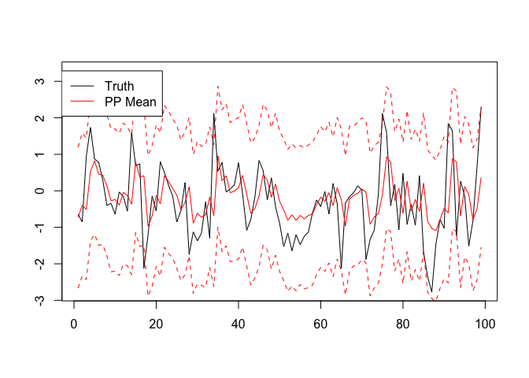

``` r
mean((y.test - p.mean)^2)
#> [1] 0.8970379
```

``` r
mean((y.test > p.upper) | (y.test < p.lower))
#> [1] 0.07070707
```

Thus, in this case, SIR did result in virtually no improvement.

## Variational Inference

We have seen above that the simplistic model approximation using
multiple Laplace approximation did not results in very good uncertainty
estimates. This was even true after correcting with SIR. In this section
we will take another approach. Instead of directly approximating one
mode, we will rather try to fit a Normal distribution to the whole
posterior. This is done by using variational inference methods. The
Julia version (BFlux.jl) does support some more sophisticated
variational families than discussed here.

BFluxR currently implementes two VI methods.

1.  Automatic Differentiation Variational Inference as implemented in
    AdvancedVI.jl
2.  Bayes By Backprop as discussed in …

### ADVI

We will first use ADVI. ADVI uses the full gradient and is thus likely
unsuited for larger data environments. See … for how ADVI works. We will
use 10 draws in each iteration to estimate the expectation and will run
ADVI for a total of 10,000 iterations.

``` r
vi.advi <- advi(bnn, 10, 10000)
```

Drawing from advi and any other VI method is done by calling `draw.vi`.
These draws can then again be used to obtain posterior predictive draws,
which in turn can be used to obtain posterior predictive means and
credible intervals.

``` r
advidraws <- draw.vi(vi.advi, 10000)
ppred <- posterior_predict(bnn, advidraws, newx = x.test)
p.mean <- apply(ppred, 1, mean)
p.upper <- apply(ppred, 1, function(x) quantile(x, 0.975))
p.lower <- apply(ppred, 1, function(x) quantile(x, 0.025))
```

This time, we can even occasionally see the credible interval. We still
seem to perform really badly though. **Note: We are estimating the wrong
model, so one should not expect the best estimates here. It is still of
interest to see how the various methodlogies reflext uncertainty. Here,
for example, we can see that ADVI has wider credible intervals,
essentially being less over-confident.**

``` r
plot(1:length(y.test), y.test, "l", col = "black", xlab = "", ylab = "", ylim = c(min(y.test), max(y.test) + 1.0))
lines(1:length(y.test), p.mean, col = "red")
lines(1:length(y.test), p.upper, col = "red", lty = 2)
lines(1:length(y.test), p.lower, col = "red", lty = 2)
legend(-3.5, max(y.test) + 1.0, c("Truth", "PP Mean"), col = c("black", "red"), lty = c(1, 1))
```


``` r
mean((y.test - p.mean)^2)
#> [1] 0.9087888
```

``` r
mean((y.test > p.upper) | (y.test < p.lower))
#> [1] 0.06060606
```

### BBB

Bayes By Backprop uses a re-parameterisation trick to push the gradient
inside the expectation. This often results in less noisy estimates. BBB
also allows for stochastic gradients, making it better suited for large
data environments. BFluxR/BFlux currently only implement BBB with a
diagonal covariance matrix, but work is in progress to allow for more
flexible VI families. The current implementation of BBB also allows for
parallel estimation of multiple approximations. This might be useful, as
these can later be combined into a single approximation.

``` r
# We choose a mini-batch size of 99 with 1000 epochs resulting in roughly 
# 5000 total iterations. 
vi.bbb <- bbb(bnn, 10, 3000, 99, nchains = 4)
```

Contrary to ADVI, BBB also keeps track of the ELBO during optimisation,
and hence convergence can be checked in a visual way by plotting these
learning curves.

``` r
library(tidyverse)
#> ── Attaching packages ─────────────────────────────────────── tidyverse 1.3.1 ──
#> ✓ ggplot2 3.3.5     ✓ purrr   0.3.4
#> ✓ tibble  3.1.6     ✓ dplyr   1.0.7
#> ✓ tidyr   1.1.4     ✓ stringr 1.4.0
#> ✓ readr   2.0.2     ✓ forcats 0.5.1
#> ── Conflicts ────────────────────────────────────────── tidyverse_conflicts() ──
#> x dplyr::filter() masks stats::filter()
#> x dplyr::lag()    masks stats::lag()
losses <- tibble(data.frame(vi.bbb$losses))
losses["iteration"] <- 1:nrow(losses)
losses %>%
  pivot_longer(-iteration, names_to = "Chain", values_to = "loss") %>%
  ggplot(aes(x = iteration, y = loss)) + 
  geom_line(aes(color = Chain)) + 
  theme_bw()
```

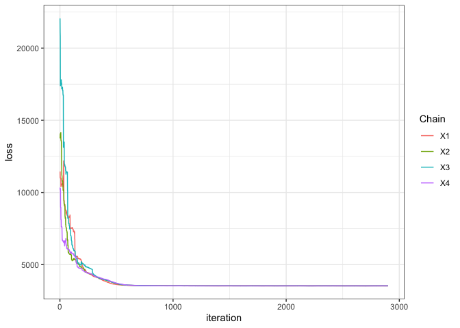

Drawing from and obtaining posterior predictive values works just the
same as for ADVI. The only try difference is that we have four ‘Chains’
now. BFluxR/BFlux currently implemented behaviour is to combines all
four estimates into a mixture distribution with equal weights. This can
be changed in the Julia version but not currently in the R version.

``` r
drawsbbb <- draw.vi(vi.bbb, 10000)
ppred <- posterior_predict(bnn, drawsbbb, newx = x.test)
p.mean <- apply(ppred, 1, mean)
p.upper <- apply(ppred, 1, function(x) quantile(x, 0.975))
p.lower <- apply(ppred, 1, function(x) quantile(x, 0.025))
```

Instead of plotting everything again, we will this time just look at
numbers. We find that BBB performs even worse than the others. **Again
note we are estimating clearly the wrong model.**

``` r
mean((y.test-p.mean)^2)
#> [1] 0.9096743
```

``` r
mean((y.test > p.upper) || (y.test < p.lower))
#> [1] 0
```

## MCMC Methods

Although probably fruitless due to using the wrong model for the data,
we can also use MCMC methods to obtain better uncertainty estimates.
BFluxR/BFlux currently implement two MCMC methods.

1.  Stochastic Gradient Langevin Dynamics (SGLD) as proposed in … but
    recently shown by … to have a zero MH acceptance probability and
    hence being impossible to monitor.
2.  Gradient Guided Monte Carlo (GGMC) as proposed in … as an
    alternative to SGLD; GGMC has positive MH acceptance probability and
    hence is often better to monitor.

BFluxR/BFlux do not implement the more common NUTS sampler. This choice
was made because NUTS does not scale well with the data set size (it
does not allow for stochastic gradient). Neal (Baysian Learning for
Neural Network) has tested partial gradient (stochastic gradients) in
his work …

**Note: BFluxR/BFlux MCMC implementation currently suffer from mixing
problems. Finding good sampler for the complex topology of Bayesian
Neural Networks still seems to be an open problem. … et al have proposed
stacking, which would be a good alternative if multiple chains do not
mix. Currently the problem is though, that even a single chain takes
very long to be mixing and usually suffers from very high
auto-correlations.**

### SGLD

We can use SGLD to estimate the network by calling `sgld` in a similar
manner to how we called `find_mode_sgd`.

``` r
# Again working with mini-batches of size 99 
# with 10K epochs result in 50K steps (draws). 
.set_seed(6150533)
#> Set the seed of Julia and R to 6150533
samples.sgld <- sgld(bnn, 99, 10000, nchains = 4, stepsize_a = 0.001, stepsize_b = 100)
```

``` r
plot(1:ncol(samples.sgld), samples.sgld[8, , 1], 'l', xlab = "", ylab = "", 
     ylim = c(min(samples.sgld[8, ,]) - 0.5, max(samples.sgld[8, , ]) + 0.5))
lines(1:ncol(samples.sgld), samples.sgld[8, , 2], col = 2)
lines(1:ncol(samples.sgld), samples.sgld[8, , 3], col = 3)
lines(1:ncol(samples.sgld), samples.sgld[8, , 4], col = 4)
```

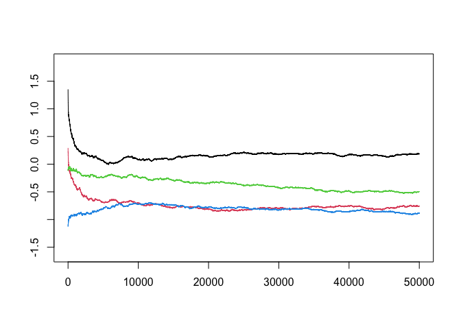

``` r
# Using the last 20K draws
ppred <- posterior_predict(bnn, samples.sgld[, 30000:50000, ], newx = x.test)
dim(ppred)
#> [1]    99 20001     4
```

Although in MSE sense we are performing worse, SGLD, as expected, shows
better uncertainty estimates (still very bad though).

``` r
p.mean <- apply(ppred, c(1, 3), mean)
mse <- apply(p.mean, 2, function(x) mean((y.test - x)^2))
mse
#> [1] 1.1072837 0.9336766 0.9835985 1.0074986
```

``` r
p.upper <- apply(ppred, c(1, 3), function(x) quantile(x, 0.975))
p.lower <- apply(ppred, c(1, 3), function(x) quantile(x, 0.025))
below <- apply(p.lower, 2, function(x) (y.test < x))
above <- apply(p.upper, 2, function(x) (y.test > x))

apply(below | above, 2, mean)
#> [1] 0.03030303 0.12121212 0.08080808 0.06060606
```

These better credible intervals can also be seen in the graph below.

``` r
plot(1:length(y.test), y.test, "l", col = "black", xlab = "", ylab = "", ylim = c(min(y.test), max(y.test) + 1.0))
lines(1:length(y.test), p.mean[, 1], col = "red")
lines(1:length(y.test), p.upper[, 1], col = "red", lty = 2)
lines(1:length(y.test), p.lower[, 1], col = "red", lty = 2)
legend(-3.5, max(y.test) + 1.0, c("Truth", "PP Mean"), col = c("black", "red"), lty = c(1, 1))
```

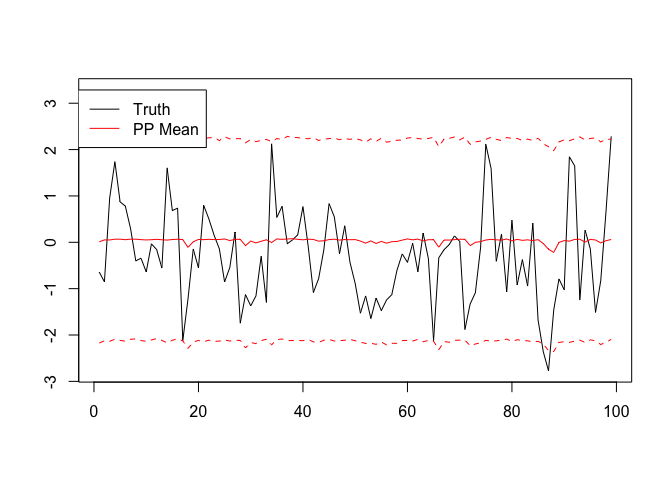

### GGMC

As mentioned above … recently pointed out that SGLD and many other
SGMCMC methods using the Euler-Maruyama method to discretesize the SDEs
have a zero MH acceptance rate. Thus, although these schemes have
guarantees under certain conditions and as the stepsize decreases to
zero, they will still always have a zero MH acceptance rate and are thus
impossible to correct (correct for the discretisation). Instead …
propose the use of GGMC which can be used with stochastic gradients and
delayed acceptance and has a strictly positive MH acceptance rate.
BFluxR/BFlux implements GGMC using stochastic gradients and delayed
acceptance. The latter of which is set using the `keep_every` argument.
As the name suggests, delayed acceptance is implemented by taking
multiple steps and only keeping the last of these multisteps if the
proposal was accepted. BFluxR/BFlux also implements an adaptation phase
inspired by [PyMC3’s tuning
phase](https://colcarroll.github.io/hmc_tuning_talk/) and [Stan’s
tuning](https://mc-stan.org/docs/2_18/reference-manual/hmc-algorithm-parameters.html).
Experience tells me that mass adaptation often does not work too well
yet and thus here we will choose only to adapt

which, as … show, has a direct connection to the stepsize. We will keep
all other default parameters for now.

``` r
.set_seed(6150533)
#> Set the seed of Julia and R to 6150533
samples.ggmc <- ggmc(bnn, 99, 20000, nchains = 4, adapth = TRUE, 
                     goal_accept_rate = 0.8, keep_every = 5, l = 0.00001, beta = 0.1)
```

One obsevation that I thus far made is that GGMC often suffers from very
poor mixing within and across chains, which is also what we observe
below. However, dispite this, GGMC still often manages to outperform the
other methods in MSE and coverage of credible intervals. Here, for
example, GGMC is the only one that even gets close to the 5% coverage of
our credible intervals.

``` r
s.ggmc <- samples.ggmc$samples
plot(1:ncol(s.ggmc), s.ggmc[8, , 1], "l", col = 1, xlab = "", ylab = "", 
     ylim = c(min(s.ggmc[8, , ]) - 0.5, max(s.ggmc[8, , ]) + 0.5))
lines(1:ncol(s.ggmc), s.ggmc[8, , 2], col = 2)
lines(1:ncol(s.ggmc), s.ggmc[8, , 3], col = 3)
lines(1:ncol(s.ggmc), s.ggmc[8, , 4], col = 4)
```

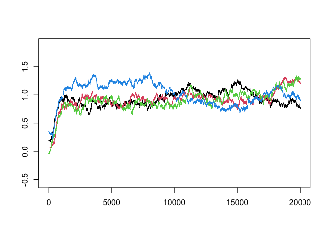

``` r
ppred <- posterior_predict(bnn, s.ggmc[, 5000:ncol(s.ggmc), ], newx = x.test)
dim(ppred)
#> [1]    99 15002     4
```

``` r
p.mean <- apply(ppred, c(1, 3), mean)
apply(p.mean, 2, function(x) mean((y.test - x)^2))
#> [1] 0.9165317 0.9188485 0.9125680 0.9134622
```

``` r
p.upper <- apply(ppred, c(1, 3), function(x) quantile(x, 0.975))
p.lower <- apply(ppred, c(1, 3), function(x) quantile(x, 0.025))
below <- apply(p.lower, 2, function(x) (y.test < x))
above <- apply(p.upper, 2, function(x) (y.test > x))

apply(below | above, 2, mean)
#> [1] 0.06060606 0.06060606 0.07070707 0.07070707
```

We can also plot this again to see that indeed GGMC (here only the first
chain) prevides reasonable credibile intervals.

``` r
plot(1:length(y.test), y.test, "l", col = "black", xlab = "", ylab = "", ylim = c(min(y.test), max(y.test) + 1.0))
lines(1:length(y.test), p.mean[, 1], col = "red")
lines(1:length(y.test), p.upper[, 1], col = "red", lty = 2)
lines(1:length(y.test), p.lower[, 1], col = "red", lty = 2)
legend(-3.5, max(y.test) + 1.0, c("Truth", "PP Mean"), col = c("black", "red"), lty = c(1, 1))
```

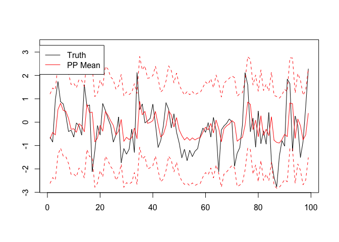

The observations above still leave open the question though whether the
chains are also different in the posterior predictive space. We have
seen above that they mix badly within and across chains. Below we
observe that it is exactly the opposite in the posterior predictive
space.

``` r
plot(1:ncol(ppred), ppred[50, , 1], "l", xlab = "", ylab = "")
lines(1:ncol(ppred), ppred[50, , 2], col = 2)
lines(1:ncol(ppred), ppred[50, , 3], col = 3)
lines(1:ncol(ppred), ppred[50, , 4], col = 4)
```

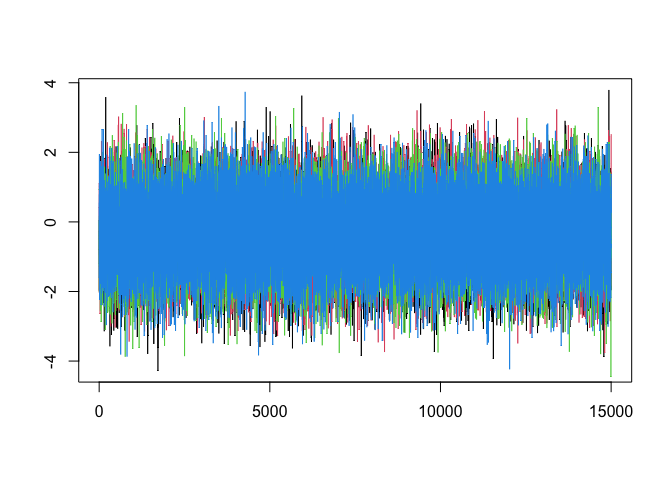

## Recurrent Networks

So far we have only focused on Dense layers. BFluxR/BFlux also support
RNN and LSTM layers. While creating a network and likelihood is pretty
much the same, care must be taken with the format of the data.

``` r
net <- Chain(LSTM(1, 1), Dense(1, 1))
loglike <- likelihood.seqtoone_normal(Gamma(2.0, 2.0))
```

Here we are focussing on seq-to-one problems. This is currently the only
recurrent structure implements. BFlux.jl allows for easy extension of
this, which is currently not feasible in the R version. We can transform
our AR(1) problem into a seq-to-one problem by taking subsequences of
observations. For example, we could take sequences with a max length of
10 period. This essentially sets hard constraints on the memory of the
process - Everything longer than 10 periods ago does no longer matter.
Using these subsequences of 10 periods, we would like to predict the
outcome of the following period.

Like mentioned above, the only true difference to Dense layers is that
we need to be careful of how we structure out data. We essentially need
to map it into a sequence of matrices. Each Matrix represents the
futures at that sequence point for all (sub)sequences. `tensor_embed`
makes it easy to obtain the right format. Here we want to embed y into
subsequeces of length 5.

``` r
tensor <- tensor_embed(y, len_seq = 10 + 1)
y <- tensor[,,6]
x <- tensor[,,-6, drop = FALSE]
train <- floor(0.75*length(y))
y.train <- y[1:train]
y.test <- y[(train+1):length(y)]
x.train <- x[, 1:train, , drop = FALSE]
x.test <- x[, (train+1):ncol(x), , drop = FALSE]
```

We are now ready to create a Baysian LSTM out of this.

``` r
bnn <- BNN(net, loglike, y.train, x.train)
```

All estimation methods from the previous section are available. Here
GGMC was chosen.

``` r
.set_seed(6150533)
#> Set the seed of Julia and R to 6150533
samples.ggmc <- ggmc(bnn, 99, 10000, nchains = 4, keep_every = 3)
```

``` r
s.ggmc <- samples.ggmc$samples
ppred <- posterior_predict(bnn, s.ggmc[, 50:ncol(s.ggmc), ], newx = x.test)
p.mean <- apply(ppred, c(1, 3), mean)
apply(p.mean, 2, function(x) mean((y.test - x)^2))
#> [1] 1.103247 1.061714 1.079240 1.114844
```

``` r
p.upper <- apply(ppred, c(1, 3), function(x) quantile(x, 0.975))
p.lower <- apply(ppred, c(1, 3), function(x) quantile(x, 0.025))
below <- apply(p.lower, 2, function(x) (y.test < x))
above <- apply(p.upper, 2, function(x) (y.test > x))

apply(below | above, 2, mean)
#> [1] 0.06756757 0.06081081 0.06756757 0.05405405
```

The rest of the analysis would be the exact same as above.

## Overview: Estimation

BFluxR/BFlux currently implements Bayesian estimation on three different
accuracy levels. The first is modal approximations which are implemented
using Diagonal-multivariate-Gaussian Laplace approximations of a mode.
These can also be used as a mixture if the approximations are done for
multiple modes. This follows Gelman et al. (2013). Modal approximations
can be corrected using Sampling-Importance-Resampling, as suggested in
Gelman et al. (2013).

The second level of accuracy is given by Variational Approximations or
Variational Inference. Currently two VI methods are implemented:
Automatic Differentiation Variational Inference (ADVI) (Kucukelbir et
al. 2015; Ge, Xu, and Ghahramani 2018) and Bayes By Backprop (BBB)
(Blundell et al. 2015; Jospin et al. 2022). ADVI does currently not
allow for stochastic gradients and thus scales badly with the data set
size. It does allow for a much more flexible variational distribution
though. BBB, as currently implemented, does allow for stochastic
gradients and mini-batches and thus scales better, but currently only
supports diagonal-multivariate-Gaussians. Due to its scalability, BBB
can be estimated using various starting points though, allowing also
here to take a mixture of approximations. BFlux/BFluxR allows to do this
in parallel.

The third level of approximations is given by Markov Chain Monte Carlo
Methods (MCMC). Two methods are currently implemented. The most natural
to most machine learning researchers due to its similarity to standard
Neural Network estimation is Stochastic Gradient Langevin Dynamics as
introduced by Welling and Teh (2011). SGLD could be summarised as doing
SGD with additional gradient noise in each iteration. Welling and Teh
(2011) show that as the step size goes to zero, the discrete SGLD
algorithm converges to Langevin Dynamics which have the posterior as
their stationary distribution. Garriga-Alonso and Fortuin (2021)
recently showed though, that although the statement is true, for any
stepsize greater than zero (and thus essentially always), SGLD and other
SGMCMC (Nemeth and Fearnhead 2021) methods have a zero
Metropolis-Hastings (MH) acceptance probability. They point out that
this is due to the Euler-Maruyama method used to discretesize Langevin
Dynamics. Due to the zero MH acceptance probability, SGLD cannot be
corrected for the discretization error using the common MH scheme and is
thus difficult to monitor. So SGLD should always be just seen as another
approximation with (in practical scenarios) essentially no convergence
guarantees. As a remedy to this shortcoming Garriga-Alonso and Fortuin
(2021) propose the use of Gradient Guided Monte Carlo (GGMC) which can
be, and is in BFluxR/BFlux, implemented using stochastic gradient
methods. GGMC uses a reversible integrator and thus the MH acceptance
probability is positive. Moreoever, the mass matrix and step length can
be tuned along the the lines of standard Hamiltonian Monte Carlo
adaptations/tuning. BFluxR/BFlux currently implements these tunings,
although in a simplified way currently.

## Current Problems and Shortcomings

## References

<div id="refs" class="references csl-bib-body hanging-indent">

<div id="ref-bayesbybackprop" class="csl-entry">

Blundell, Charles, Julien Cornebise, Koray Kavukcuoglu, and Daan
Wierstra. 2015. “Weight Uncertainty in Neural Network.” In
*International Conference on Machine Learning*, 1613–22. PMLR.

</div>

<div id="ref-garriga2021exact" class="csl-entry">

Garriga-Alonso, Adrià, and Vincent Fortuin. 2021. “Exact Langevin
Dynamics with Stochastic Gradients.” *arXiv Preprint arXiv:2102.01691*.

</div>

<div id="ref-turing" class="csl-entry">

Ge, Hong, Kai Xu, and Zoubin Ghahramani. 2018. “Turing: A Language for
Flexible Probabilistic Inference.” In *International Conference on
Artificial Intelligence and Statistics, AISTATS 2018, 9-11 April 2018,
Playa Blanca, Lanzarote, Canary Islands, Spain*, 1682–90.
<http://proceedings.mlr.press/v84/ge18b.html>.

</div>

<div id="ref-bda3" class="csl-entry">

Gelman, Andrew, John B. Carlin, Hal S. Stern, David B. Dunson, Aki
Vehtari, and Donald B. Rubin. 2013. *Bayesian Data Analysis*. 3rd ed.
Chapman &amp; Hall/CRC.

</div>

<div id="ref-jospin2022hands" class="csl-entry">

Jospin, Laurent Valentin, Hamid Laga, Farid Boussaid, Wray Buntine, and
Mohammed Bennamoun. 2022. “Hands-on Bayesian Neural Networks—a Tutorial
for Deep Learning Users.” *IEEE Computational Intelligence Magazine* 17
(2): 29–48.

</div>

<div id="ref-advi2015" class="csl-entry">

Kucukelbir, Alp, Rajesh Ranganath, Andrew Gelman, and David Blei. 2015.
“Automatic Variational Inference in Stan.” *Advances in Neural
Information Processing Systems* 28.

</div>

<div id="ref-nemeth2021stochastic" class="csl-entry">

Nemeth, Christopher, and Paul Fearnhead. 2021. “Stochastic Gradient
Markov Chain Monte Carlo.” *Journal of the American Statistical
Association* 116 (533): 433–50.

</div>

<div id="ref-welling2011bayesian" class="csl-entry">

Welling, Max, and Yee W Teh. 2011. “Bayesian Learning via Stochastic
Gradient Langevin Dynamics.” In *Proceedings of the 28th International
Conference on Machine Learning (ICML-11)*, 681–88. Citeseer.

</div>

</div>
