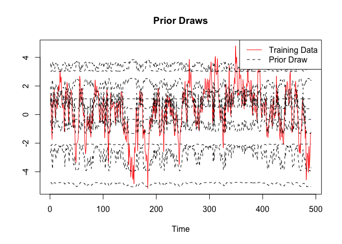
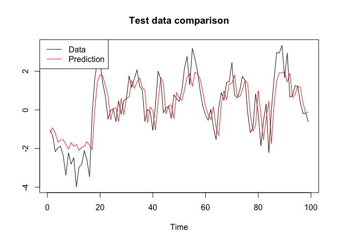

<!-- README.md is generated from README.Rmd. Please edit that file -->

# BayesFluxR

<!-- badges: start -->

[](https://github.com/enweg/BayesFluxR/actions/workflows/test-coverage.yaml)
[](https://github.com/enweg/BayesFluxR/actions/workflows/check-standard.yaml)
<!-- badges: end -->

> :warning: **Known Issues**
>
> - The first call of `BayesFluxR_setup` can take a while. On some
>   machines this could take twenty minutes or longer. This is most
>   likely due to that Julia first needs to be set up. If you want to
>   check whether everything is still going well, you can always check
>   in the task manager if the Julia background process is still busy.
>   As long as this is the case, everything is going right.
>
> - Please always call `library(BayesFluxR)` before calling
>   `BayesFluxR_setup`. Calling `BayesFluxR::BayesFluxR_setup` throws an
>   error that I do not know how to solve at this point (feel free to
>   open a pull request)
>
> - Some systems, especially on company computers, cause failures in the
>   automatic setup of BayesFluxR. In these cases, please try the
>   following
>
>   1.  Install Julia manually by following the official instructions.
>       Link this manual installation to BayesFluxR by calling
>       `BayesFluxR_setup(JULIA_HOME="path-to-julia-binary", env_path="path-to-some-writable-folder", pkg_check=TRUE)`
>   2.  Make sure that the environment path you are choosing is
>       writable. On some systems Julia is not allowed to write to some
>       locations. A safe choice is usually to choose a folder on the
>       Desktop. Note that in the example below I am using the temporary
>       folder on a Mac. This will often not work on company computers.
>   3.  If the above still do not work, try to force reinstall
>       BayesFluxR and try the steps again. If it still does not work,
>       please open an issue.

**Goals and Introduction**

BayesFluxR is a R interface to BayesFlux.jl which itself extends the
famous Flux.jl machine learning library in Julia. BayesFlux is meant to
make research and testing of Bayesian Neural Networks easy. It is not
meant for production, but rather for explorations. Currently only
regression problems are being kept in mind during the development, since
those are the problems I am working on. Extending things to
classification problems should be rather straight forward though, since
BayesFlux allows custom implementation of likelihoods and priors (at
least in the Julia version). In the R version presented here, this is
currently not possible.

## Basics

BayesFluxR and BayesFlux are based on Flux.jl and thus take over a lot
of Flux’s syntax. Before we demonstrate this, we first need to install
and load BayesFluxR. Installation is currently only possible from
Github:

``` r
# devtools::install_github("enweg/BayesFluxR")
```

BayesFluxR depends on BayesFlux.jl which is a library written in Julia.
Hence, to run BayesFluxR, we need a way to access Julia. This is
provided by the JuliaCall library. So we also need to install that
library.

We are now ready to start exploring BayesFluxR. We first need to load
the package and run the setup. This will install Julia if you do not yet
have it and will install all the Julia dependencies, including
BayesFlux.jl. If you already do have Julia installed, then the script
will pick the Julia version on your computer. If you, like me, have
multiple versions installed, then you can define the version you want to
use by setting the `JULIA_HOME` variable to the path of the Julia
version you want to use.

Running these lines for the first time can take a while, since it will
possibly have to install Julia and all dependencies. After this, if you
do no longer wish you check if all dependencies are available, you can
set `pkg_check = FALSE`.

We also set a working environment for Julia. This is generally good
practice and should in real projects be the project directory. It is
also good practice to already set a seed. This seed will be set in both
R and in Julia. If you wish to set a seed later on, please use
`.set_seed` which sets the seed in both Julia and R.

``` r
library(BayesFluxR);
# The line below sets up everything automatically, but sometimes fails
# BayesFluxR_setup(installJulia = TRUE, seed = 6150533, env_path = "/tmp", pkg_check = TRUE)
# If the automatic setup failed or you wish to use a specific verions of Julia, 
# then use the JULIA_HOME argument. The path below is for a Mac. 
BayesFluxR_setup(JULIA_HOME="/Applications/Julia-1.8.app/Contents/Resources/julia/bin/", 
             seed = 6150533, 
             env_path = "/tmp");
```

After loading BayesFluxR and running the setup, we are now ready to
experiment around. To create a Bayesian Neural Network, we first need a
Neural Network. In the Flux.jl context and thus also here, a network is
defined as a chain of layers. This is intuitively represented in the
syntax below, which creates a Feedforward Neural Network with one hidden
layer with `tanh` activation function. The last `Dense(1, 1)` statement
is the output connection. The chain below thus says: Feed a vector $x$
into the network. Transform this input via $act=tanh(x'w_1 + b_1)$. The
output is then given by $\hat{y} = act'w_2 + b_2$.

``` r
net <- Chain(Dense(1, 1, "tanh"), Dense(1, 1))
```

To transform this standard Neural Network into a Bayesian NN, we need a
likelihood and priors for all parameters. BayesFluxR view on priors and
likelihoods might be a bit unintuitive at the beginning: a prior
function only defines priors for the network parameters. Priors for all
parameters introduced by the likelihood, such as the standard deviation,
are defined in the likelihood functions. So, for example, we can use a
Gaussian prior for all network parameters

``` r
prior <- prior.gaussian(net, 0.5)  # sigma = 0.5
```

and can define a Gaussian likelihood. The Gaussian likelihood also
introduces a standard deviation though, which in BayesFlux terms must be
given a prior when defining the likelihood: it is not included in the
prior above, which applies only to the network parameters. Here we use a
Gamma prior for the standard deviation.

``` r
like <- likelihood.feedforward_normal(net, Gamma(2.0, 0.5))
```

For all of the estimation methods in BayesFluxR, we need some initial
values. BayesFluxR handles this via initialisers, which essentially just
tell it how to initialise all parameters. Currently only one kind of
initialiser is implemented: Initialising all parameters (network and
likelihood) by drawing randomly from a distribution. Users are free to
extend this in Julia, but this is currently not feasible in the R
version.

``` r
# Initialising all values by drawing from a Gaussian
init <- initialise.allsame(Normal(0, 0.5), like, prior)
```

Now that we have priors on all parameters as well as a likelihood, all
that is left is to have some data. Here we will take an AR(1) for the
simple reason that time series applications were the first application
for which BayesFluxR and BayesFlux were implemented.

``` r
n <- 600
y <- arima.sim(list(ar = 0.5), n = 600)
y.train <- y[1:floor(5/6*n)]
y.test <- y[(floor(5/6*n)+1):n]
x.test <- matrix(y.test[1:(length(y.test)-1)], nrow = 1) # In BayesFlux, rows are variables, columns are observations
x.train <- matrix(y.train[1:(length(y.train)-1)], nrow = 1)
y.test <- y.test[2:length(y.test)]
y.train <- y.train[2:length(y.train)]

plot.ts(y, xlab = "", ylab = "", main = "Simulated AR(1) Data")
abline(v = 500, lty = 2, lw = 2, col = "red")
text(x = 500, y = 2.5, labels = "End Training Data", col = "red")
```


We now have everything to create a Bayesian Model. This is simply done
by calling `BNN` with the data, the likelihood, the prior, and the
initiliser. The prior and likelihood contain information about the
network structure, and thus it is not necessary to explicitly give the
network structure anymore.

``` r
bnn <- BNN(x.train, y.train, like, prior, init)
```

## Mode and Modal Approximations

The easiest way to test a BNN and to obtain a first estimate is by using
the MAP or the mode of the posterior distribution. BayesFluxR achieves
this by using stochastic gradient descent type of algorithms. Currently
implemented are `opt.ADAM`, `opt.RMSProp`, and `opt.Descent`.

``` r
# we are using ADAM with a batchsize of 10 and run for 1000 epochs
opt <- opt.ADAM()
mode <- find_mode(bnn, opt, 10, 1000)
```

We can use this mode estimate to draw from the posterior predictive.
Given that the mode is just a single value of the posterior, we will
replicate the mode estimate multiple times. This will still only
correspond to the one point in the posterior distribution, but will
deliver us multiple estimates (multiple draws from the posterior
characterised by the MAP).

``` r
post_draws <- matrix(rep(mode, 1000), ncol = 1000)
post_values.train <- posterior_predictive(bnn, post_draws, x = x.train)
post_values.test <- posterior_predictive(bnn, post_draws, x = x.test)

yhat.train <- apply(post_values.train, 1, mean)
yhat.test <- apply(post_values.test, 1, mean)
```

We can now check how good these predictions are:

``` r
mse.train <- mean((y.train - yhat.train)^2)
mse.test <- mean((y.test - yhat.test)^2)

c(mse.train, mse.test)
#> [1] 1.045913 1.049174
```

``` r
plot(y.test, type = "l", xlab = "Time", ylab = "", main = "Test data performance", col = 1)
lines(yhat.test, col = 2)
legend(x = 0, y = 3, c("y", "yhat"), col = c(1, 2), lty = c(1, 1))
```


## Variational Inference

The next step up from a MAP estimate is a Variational Inference
estimate. BayesFluxR currently implements Bayes by Backprop (BBB)
(Blundell et al. 2015) using a Multivariate Gaussian with diagonal
covariance matrix as proposal family. Although BBB is the standard in
Bayesian NN, it can at time be restrictive. For that reason, BayesFlux
allows for extensions in the Julia version, not currently though in the
R version.

``` r
# using a batchsize of 10 and running for 1000 epochs
vi <- bayes_by_backprop(bnn, 10, 1000)
```

BBB does not itself return posterior draws yet. Instead, it returns
information about how the distribution looks like, restricted by it
being a Multivariate Gaussian with diagonal variance. To actually obtain
draws, we still need to sample from this variational family.

``` r
post_samples <- vi.get_samples(vi, n = 1000)
```

We can then use these draws like we would use any other posterior draws.
For BNNs we are usually not interested in the actual parameters, but
rather in the posterior predictive distribution. As such, we can use
these draws to obtain posterior predictive draws.

``` r
post_values.train <- posterior_predictive(bnn, post_samples, x = x.train)
post_values.test <- posterior_predictive(bnn, post_samples, x = x.test)

yhat.train <- apply(post_values.train, 1, mean)
upper.train <- apply(post_values.train, 1, function(x) quantile(x, 0.975))
lower.train <- apply(post_values.train, 1, function(x) quantile(x, 0.025))

yhat.test <- apply(post_values.test, 1, mean)
upper.test <- apply(post_values.test, 1, function(x) quantile(x, 0.975))
lower.test <- apply(post_values.test, 1, function(x) quantile(x, 0.025))


data.frame(
  mse.train = mean((y.train - yhat.train)^2),
  mse.test = mean((y.test - yhat.test)^2),
  coverage.train = mean(((y.train < upper.train) & (y.train > lower.train))),
  coverage.test = mean(((y.test < upper.test) & (y.test > lower.test)))
)
#>   mse.train mse.test coverage.train coverage.test
#> 1  1.051824 1.038127      0.9418838     0.9494949
```

## MCMC Methods

BayesFluxR implements various Markov Chain Monte Carlo methods that can
be use to obtain approximate draws from the posterior. Currently
implemented are

- Stochastic Gradient Langevin Dynamics (SGLD) (Welling and Teh 2011):
  `sampler.SGLD`
- Stochastic Gradient Nose-Hoover Thermostat (SGNHTS) (Leimkuhler and
  Shang 2016): `sampler.SGNHTS`
- Gradient Guided Monte Carlo (GGMC) (Garriga-Alonso and Fortuin 2021):
  `sampler.GGMC`
- Hamiltonian Monte Carlo (HMC): `sampler.HMC`
- Adaptive Metropolis Hastings (AdaptiveMH) (Haario, Saksman, and
  Tamminen 2001): `sampler.AdaptiveMH`

Additionally, BayesFluxR allows for adaptation of mass matrices and
stepsizes for some of the samplers above:

- Mass adaptation via `madapter.DiagCov`, `madapter.FullCov`,
  `madapter.FixedMassMatrix` or `madapter.RMSProp` can be done for
  SGNHTS, GGMC, and HMC
- Step size adaptation via `sadapter.Const` or `sadapter.DualAverage`
  can be done for GGMC and HMC since these two are the only samplers
  using both gradients and a Metropolis-Hastings accept/reject step.

``` r
# sampling via sgld
sampler <- sampler.SGLD(stepsize_a = 1.0)
samples.sgld <- mcmc(bnn, 10, 10000, sampler) # batchsize 10 and 1000 samples

# sampling via SGNHTS
sampler <- sampler.SGNHTS(1e-2)
samples.sgnhts <- mcmc(bnn, 10, 10000, sampler)

# sampling using GGMC with fixed mass but stepsize adaptation
madapter = madapter.FixedMassMatrix()
sadapter = sadapter.DualAverage(1000, initial_stepsize = 1) # 1000 adaptation steps
sampler <- sampler.GGMC(l = 1, sadapter = sadapter, madapter = madapter)
samples.ggmc <- mcmc(bnn, 10, 10000, sampler)

# sampling using HMC
# This time batchsize is is length of y thus no batching
sadapter <- sadapter.DualAverage(1000, initial_stepsize = 0.001)
madapter <- madapter.FixedMassMatrix()
sampler <- sampler.HMC(l = 0.001, path_len = 5, sadapter = sadapter, madapter = madapter)
samples.hmc <- mcmc(bnn, length(y.train), 10000, sampler)

# sampling using Adaptive MH
# this does not use any gradients so we start at a mode 
sampler <- sampler.AdaptiveMH(bnn, 1000, 0.1)
samples.amh <- mcmc(bnn, 10, 10000, sampler, start_value = mode)
```

All of these samples can be used in the same way. For example, we can
use the samples obtained using SGNHTS to draw from the posterior
predictive. *We are again not really interested in the actual
parameters, but much more in the posterior predictive values and the
network output space*.

``` r
post_values.train <- posterior_predictive(bnn, samples.sgnhts$samples, x = x.train)
post_values.test <- posterior_predictive(bnn, samples.sgnhts$samples, x = x.test)


yhat.train <- apply(post_values.train, 1, mean)
upper.train <- apply(post_values.train, 1, function(x) quantile(x, 0.975))
lower.train <- apply(post_values.train, 1, function(x) quantile(x, 0.025))

yhat.test <- apply(post_values.test, 1, mean)
upper.test <- apply(post_values.test, 1, function(x) quantile(x, 0.975))
lower.test <- apply(post_values.test, 1, function(x) quantile(x, 0.025))


data.frame(
  mse.train = mean((y.train - yhat.train)^2),
  mse.test = mean((y.test - yhat.test)^2),
  coverage.train = mean(((y.train < upper.train) & (y.train > lower.train))),
  coverage.test = mean(((y.test < upper.test) & (y.test > lower.test)))
)
#>   mse.train mse.test coverage.train coverage.test
#> 1   1.04987 1.048984      0.9438878     0.9494949
```

It is often a good idea to check whether at least the parameters
additionally introduces by the likelihood have reasonable chains.
Although better statistics exist, here we will only check it visually.
Sigma is here given by the last parameter. In general, if the likelihood
introduces k parameters, then the last k parameters in each draw are
those of the likelihood.

``` r
s <- samples.sgnhts$samples
sigma <- s[nrow(s), ]
plot.ts(sigma)
```


What if we were not happy or if the chain had not yet converged? In that
case we can just continue sampling instead of having to start fresh.

``` r
samples.sgnhts.cont <- mcmc(bnn, 10, 20000, sampler = samples.sgnhts$sampler, continue_sampling = TRUE)

list(
  dim(samples.sgnhts.cont$samples), 
  all.equal(samples.sgnhts$samples, samples.sgnhts.cont$samples[, 1:10000])
)
#> [[1]]
#> [1]     5 20000
#> 
#> [[2]]
#> [1] TRUE
```

## Recurrent Structures

Next to Dense layers, BayesFluxR currently supports the use of RNN and
LSTM layers. Currently only seq-to-one tasks are supported (only those
likelihoods are implemented) and extension possibilities do currently
only exist in the Julia version, but the plan is to update this soon.

Say we have a time series $y$ with possibly non-linear dynamics. We can
then split this time series into overlapping subsequences and use each
of these subsequences to predict the value that would come in $y$ after
the subsequence ends. This way we can train an RNN or LSTM network with
a single time series.

To support the above, BayesFluxR comes with a utility function
`tensor_embed_mat` which takes a matrix of time series and embeds it
into a tensor consisting of dimensions
$seqlen \times numvariables \times numsubsequences$.

``` r
# We want to split the single TS into overlapping subsequences of 
# length 10 and use these to predict the next observation
y <- arima.sim(list(ar = 0.8), n = 600)
tensor <- tensor_embed_mat(matrix(y, ncol = 1), len_seq = 10 + 1)
dim(tensor)
#> [1]  11   1 590
```

We now have a tensor with subsequences of length 11, the first 10
elements of each sequence are used to predict the 11th element.

``` r
y.rnn <- tensor[11, , ]
x.rnn <- tensor[1:10, , ,drop = FALSE]

train_to <- floor(5/6 * length(y.rnn))
y.train <- y.rnn[1:train_to]
y.test <- y.rnn[(train_to+1):length(y.rnn)]
x.train <- x.rnn[, , 1:train_to, drop = FALSE]
x.test <- x.rnn[, , (train_to+1):length(y.rnn), drop = FALSE]
```

After bringing the data into the right format above, the rest of the
functionality is the same as for Feedforward architectures:

``` r
net <- Chain(RNN(1, 1), Dense(1, 1))
prior <- prior.mixturescale(net, 2.0, 0.1, 0.99)
like <- likelihood.seqtoone_normal(net, Gamma(2.0, 0.5))
init <- initialise.allsame(Normal(0, 0.5), like, prior)
bnn <- BNN(x.train, y.train, like, prior, init)
```

One thing not discussed above is that BayesFluxR also allows to draw
from the prior_predictive distribution. This often shows that the priors
currently used in standard work are often not the best and much work
could be done here.

``` r
prior_values <- prior_predictive(bnn, n = 10)
plot(x = 1:length(y.train), y = y.train, type = "l", xlab = "Time", ylab = "", main = "Prior Draws", col = "red")
for (i in 1:ncol(prior_values)){
  lines(prior_values[, i], col = "black", lty = 2)
}
legend("topright", c("Training Data", "Prior Draw"), col = c("red", "black"), lty = c(1, 2))
```



Estimation works the same as for Feedforward structures. For example, we
can estimate the model using SGNHTS

``` r
sampler <- sampler.SGNHTS(0.01)
chain.mcmc <- mcmc(bnn, 10, 10000, sampler)
```

And obtain the posterior predictive draws for the test data and compare
it to the actual values:

``` r
post_values.test <- posterior_predictive(bnn, chain.mcmc$samples, x = x.test)

yhat.test <- apply(post_values.test, 1, mean)
plot(y.test, type = "l", xlab = "Time", ylab = "", main = "Test data comparison", col = "black")
lines(yhat.test, col = "red")
legend("topleft", c("Data", "Prediction"), col = c("black", "red"), lty = c(1, 1))
```



<div id="refs" class="references csl-bib-body hanging-indent">

<div id="ref-blundellWeightUncertaintyNeural2015" class="csl-entry">

Blundell, Charles, Julien Cornebise, Koray Kavukcuoglu, and Daan
Wierstra. 2015. “Weight Uncertainty in Neural Networks,” 10.

</div>

<div id="ref-garrigaalonsoExactLangevinDynamics2021" class="csl-entry">

Garriga-Alonso, Adrià, and Vincent Fortuin. 2021. “Exact Langevin
Dynamics with Stochastic Gradients.” February 2, 2021.
<https://arxiv.org/abs/2102.01691>.

</div>

<div id="ref-haarioAdaptiveMetropolisAlgorithm2001" class="csl-entry">

Haario, Heikki, Eero Saksman, and Johanna Tamminen. 2001. “An Adaptive
Metropolis Algorithm.” *Bernoulli* 7 (2): 223.
<https://doi.org/10.2307/3318737>.

</div>

<div id="ref-leimkuhlerAdaptiveThermostatsNoisy2016" class="csl-entry">

Leimkuhler, Benedict, and Xiaocheng Shang. 2016. “Adaptive Thermostats
for Noisy Gradient Systems.” *SIAM Journal on Scientific Computing* 38
(2): A712–36. <https://doi.org/10.1137/15M102318X>.

</div>

<div id="ref-wellingBayesianLearningStochastic2011" class="csl-entry">

Welling, Max, and Yee Whye Teh. 2011. “Bayesian Learning via Stochastic
Gradient Langevin Dynamics,” 8.

</div>

</div>
